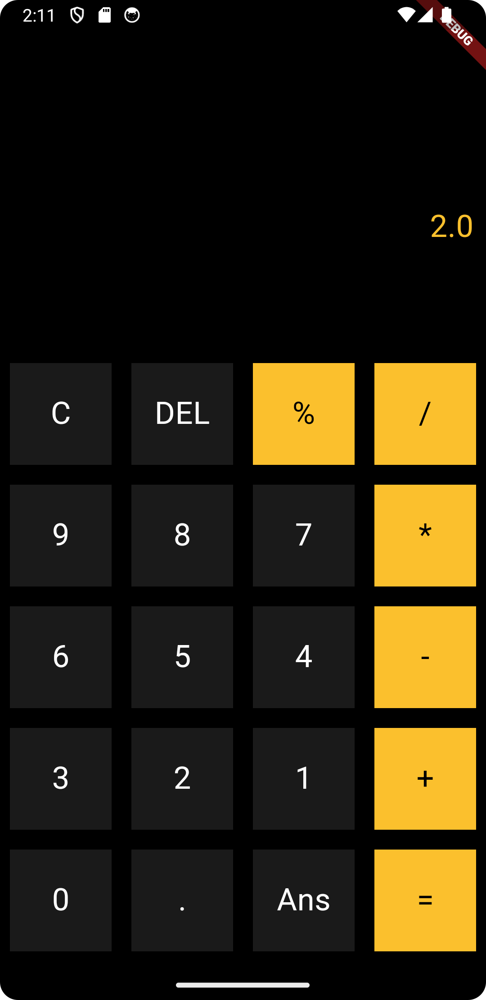

### GitHub Description:

**Flutter Calculator App**

This Flutter project is a simple calculator application that evaluates mathematical expressions using the `math_expression` package. It provides basic arithmetic operations and supports the use of parentheses for complex expressions.

### Features:

- **Math Expression Evaluation:** Utilizes the `math_expression` package to parse and evaluate mathematical expressions.
- **Basic Arithmetic Operations:** Addition, subtraction, multiplication, and division.
- **Parentheses Support:** Handle complex expressions with ease.

### Technologies Used:

- Flutter
- Dart
- `math_expression` package

### Screenshots:



### Getting Started:

1. Clone the repository:

    ```bash
    git clone https://github.com/KINDREW/calculatorapp.git
    ```

2. Navigate to the project directory:

    cd calculatorapp
    
3. Install dependencies:

    flutter pub get

4. Run the app:

    flutter run
    
### Usage:

- Enter mathematical expressions using the provided buttons.
- Press the "=" button to calculate the result.

### Contributing:

Contributions are welcome! If you have any ideas, improvements, or bug fixes, feel free to open an issue or submit a pull request.

### License:

This project is licensed under the MIT License - see the [LICENSE](LICENSE) file for details.

